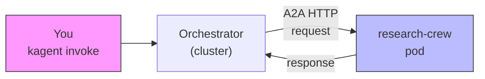
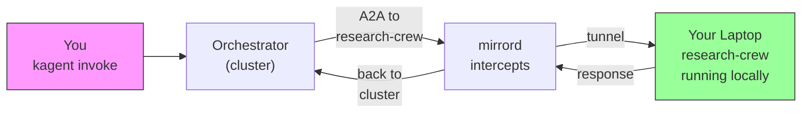

# kagent + mirrord: runtime substitution of BYO agents in multi-agent A2A chains

**AI Hackathon Submission**

Run a live kagent multi-agent orchestrator in Kubernetes, then develop and swap individual agents from your laptop in real-time—no Docker rebuild, no redeployment, same live cluster.


## The Problem: Multi-Agent Dev Loop is Slow

Building multi-agent systems in Kubernetes is powerful but frustrating to iterate on:

- **Current workflow (slow):** Edit agent code → commit → `docker build` → push to registry → `kubectl rollout` → test → **repeat** (5-10 min per iteration)
- **Pain point:** Even for small agent tweaks (change a tool, adjust a prompt, add logic), you're stuck waiting for full CI/CD
- **Worse:** You're not testing *inside* the live orchestrator—your agent is isolated, not actually in the call graph


---

## The Solution: mirrord + A2A = Live Agent Swapping

**Insight:** kagent agents talk to each other over **A2A** (Agent-to-Agent HTTP protocol). If we intercept that traffic at the network layer with [mirrord](https://mirrord.dev), we can redirect it to your local machine—**no image rebuild, no URL changes, no redeployment.**

**What you get:**
1. Keep all your agents running in Kubernetes (orchestrator, research-crew, etc.)
2. Run one agent locally under mirrord (e.g., research-crew)
3. When the orchestrator calls that agent over A2A, mirrord steals the traffic and your laptop answers
4. Edit the agent code → restart mirrord (instant) → re-invoke the orchestrator → see it work

**The win:** Iteration cycle drops from 5+ min to <5 sec. You're actually inside the multi-agent graph.

---

## Why This Matters

| Category | Standard Approach | This Solution.  |
|----------|-------------------|-----------------|
| **Dev iteration** | 5–10 min (rebuild → deploy → test) | ~5 sec (restart local process) |
| **Testing context** | Agent isolated, offline testing | Agent in live orchestrator chain, real traffic |
| **Skill** | CI/CD chops, image management | Dev tooling insight: network layers matter |
| **Stack** | Yet another dev framework | Reuses kagent + mirrord elegantly |
| **Demo-ability** | Hard; slow feedback loops | Easy; instant feedback |

---

## The Stack

- **[kagent](https://kagent.dev)** (CNCF Sandbox): declarative multi-agent orchestrator
- **[mirrord](https://mirrord.dev)** (MetalBear): network-layer traffic interception
- **CrewAI**: BYO agent framework (pluggable)
- **Anthropic Claude**: LLM backbone
- **Kubernetes** (minikube/kind): local cluster for demo

---

## Architecture

**Without mirrord** — the in-cluster pod handles all A2A to `research-crew`:



**With mirrord** — A2A traffic is intercepted and tunneled to your local machine:



---

## Live Demo (Two Terminals, ~10 Minutes)

### Prerequisites (Install Once)

```bash
# Kubernetes (local)
brew install minikube docker kubectl

# kagent CLI
brew install kagent

# mirrord (the magic)
brew install metalbear-co/mirrord/mirrord

# Set your Anthropic API key
export ANTHROPIC_API_KEY=sk-ant-...
```

### Step 1: Setup (5 min)

```bash
cd kagent-mirrord
minikube start
./scripts/setup.sh
```

**What it does:**
- Starts `minikube` (or `kind` if you prefer)
- Builds the research-crew Docker image
- Deploys kagent orchestrator + research-crew agent
- Applies Kubernetes CRDs and secrets

**Verify:** `kubectl get pods -n kagent` — expect `kagent-controller` + `research-crew` running.

### Step 2: Baseline Test (Cluster-Only, ~5 sec)

```bash
kagent invoke --agent orchestrator --task "What is kagent in one sentence?"
```

You should see the orchestrator call research-crew inside the cluster, get an answer back. **This is the "before" state.**

### Step 3: Terminal 1 — Become research-crew (Your Laptop)

```bash
./scripts/mirrord-crew.sh
```

You'll see:
```
==> Creating .venv with python3.x ...
==> Installing deps with uv ...
mirrord: Stealing traffic from deployment/research-crew
mirrord: Ready ✓
INFO:     Uvicorn running on http://0.0.0.0:8080
```

**Your laptop is now the research-crew agent. The Kubernetes pod is still there, but mirrord is stealing its traffic.**

### Step 4: Terminal 2 — Same Orchestrator, Same Call, Different Agent

```bash
kagent invoke --agent orchestrator --task "What is kagent in one sentence?"
```

**Same task. Same orchestrator. But now the orchestrator is calling YOUR laptop, not the pod.**

If you look at Terminal 1, you'll see access logs like:
```text
GET /.well-known/agent-card.json   # discovery
POST / HTTP/1.1                    # A2A JSON-RPC (default path is `/`, not `.well-known`)
```
The agent card’s **`url`** must be the **Kubernetes Service** for `research-crew` (e.g. `http://research-crew.kagent.svc.cluster.local:8080/`), not `127.0.0.1`, or in-cluster callers will POST to **their own** loopback and you’ll only see GETs for the card.

### Step 5: Live Agent Substitution (The Magic)

**In your editor, open `crew/crew.py`.** At the bottom, you'll see demo examples:

```python
# Example 2: Replace the summarizer to be sarcastic:
#
# summarizer = Agent(
#     role="Sarcastic Summarizer",
#     goal="Respond in exactly one sarcastic sentence. Never more.",
#     backstory="You are deeply unimpressed by everything.",
#     tools=[],
#     verbose=True,
#     llm=_CREW_LLM,
# )
```

**Try it:**
1. Uncomment that `summarizer` definition in the crew method (replace the default one)
2. Back in Terminal 1: **Ctrl+C** to stop mirrord
3. Re-run: `./scripts/mirrord-crew.sh`
4. In Terminal 2: Run the **same** `kagent invoke` command again

**The behavior changes.** Now the orchestrator gets a sarcastic one-liner instead of a dry summary. 

**You did NOT:**
- Rebuild the Docker image
- Push to a registry
- Restart the in-cluster pod
- Change the orchestrator config
- Update URLs

**You DID:**
- Edit Python code
- Restart one local process
- **Instantly changed agent behavior inside a live multi-agent call chain**

---

## Agent Capabilities

The **research-crew** agent includes:

- **Researcher Agent:** Uses `retrieve_context` tool to gather facts; synthesizes into 2-3 key points (under 200 words for token efficiency)
- **Summarizer Agent:** Distills findings into one sentence
- **Mock Retrieval Tool:** Preloaded with facts about kagent, mirrord, A2A (drop-in replacement for web search, vector DB, etc.)

**You can:**
1. **Swap tools:** Comment out/add `retrieve_context` in the researcher
2. **Change prompts:** Edit agent backstories and goals
3. **Modify tasks:** Change what the agents do
4. **Add new agents:** Extend the crew
5. See it all work in the live orchestrator call chain **without rebuilding**

---

## Repo Layout & Key Files

| Path | Role |
|------|------|
| **`agents/`** | `orchestrator` + `research-crew` CRD manifests; `claude-model-config` for API keys and model selection |
| **`crew/`** | CrewAI application: `main.py` (FastAPI/Uvicorn wrapper), `crew.py` (agent definitions), `Dockerfile` (in-cluster image) |
| **`mirrord/research-crew.json`** | mirrord configuration: steal target, environment overrides for local execution |
| **`scripts/`** | Automation: `setup.sh` (full cluster setup), `mirrord-crew.sh` (local dev), `validate.sh` (sanity checks) |
| **`requirements-local.txt`** | Python deps (laptop): same packages as Dockerfile, installed via `uv` for speed |

### Key File: `mirrord/research-crew.json`

```json
{
  "target": { "path": "deployment/research-crew", "namespace": "kagent" },
  "feature": {
    "network": { "incoming": { "mode": "steal" } },
    "env": {
      "include": "ANTHROPIC_API_KEY",
      "override": {
        "KAGENT_URL": "http://kagent-controller.kagent.svc.cluster.local:8083",
        "KAGENT_NAME": "research-crew",
        "KAGENT_NAMESPACE": "kagent"
      }
    }
  }
}
```

- **Target:** Pod traffic bound for `deployment/research-crew` in namespace `kagent`
- **Incoming mode:** `steal` — redirect all traffic to local process
- **Env:** Pass `ANTHROPIC_API_KEY` from cluster; override `KAGENT_*` so local agent can reach controller

---

## Scripts Reference

| Script | Command | Purpose |
|--------|---------|---------|
| **Setup** | `./scripts/setup.sh` | one-time: cluster, registry, image build, secrets, CRDs |
| **Dev** | `./scripts/mirrord-crew.sh` | create `.venv`, install deps, run mirrord + local agent |
| **Validate** | `./scripts/validate.sh` | syntax, configs, prerequisites (no cluster needed) |

**Note:** `mirrord-crew.sh` automatically picks a compatible Python ≥3.10 and uses `uv` for fast dependency resolution.

---


## What Makes This Different

**Not just "run an agent locally":**
- ✗ Most agent dev: isolated local script, mocked orchestrator, no real traffic
- ✓ This approach: **live orchestrator, real A2A traffic, authentic multi-agent context**

**Not just wrapper code:**
- ✗ Custom middleware, proxy, or orchestrator plugin
- ✓ **Pure interception at network layer** (mirrord + eBPF/system interceptor) — zero changes to orchestrator config

**Not just for single agents:**
- ✗ One-off dev tool, can't scale to team workflow
- ✓ **Any agent in the graph can be substituted** — swap orchestrator for local testing, swap multiple agents simultaneously (with multiple mirrord instances), etc.

---

## Build & Deployment

For production or extending:
```bash
docker build -t myregistry/research-crew:v0.1 crew/
docker push myregistry/research-crew:v0.1
# Update agents/research-crew.yaml image field, then: kubectl apply -f agents/
```

For local demo:
```bash
./scripts/setup.sh  # one-time
./scripts/mirrord-crew.sh  # repeat as you edit crew/crew.py
```

---

## Acknowledgements

Built for the kagent ecosystem hackathon:
- **[kagent](https://kagent.dev)** (CNCF Sandbox) — the multi-agent orchestrator
- **[mirrord](https://mirrord.dev)** (MetalBear) — the traffic interception magic
- **[CrewAI](https://github.com/joaomdmoura/crewai)** — pluggable agent framework
- **[Anthropic Claude](https://www.anthropic.com/)** — the LLM inference
