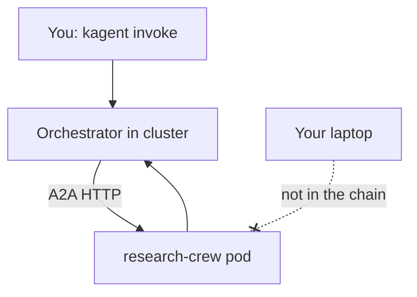
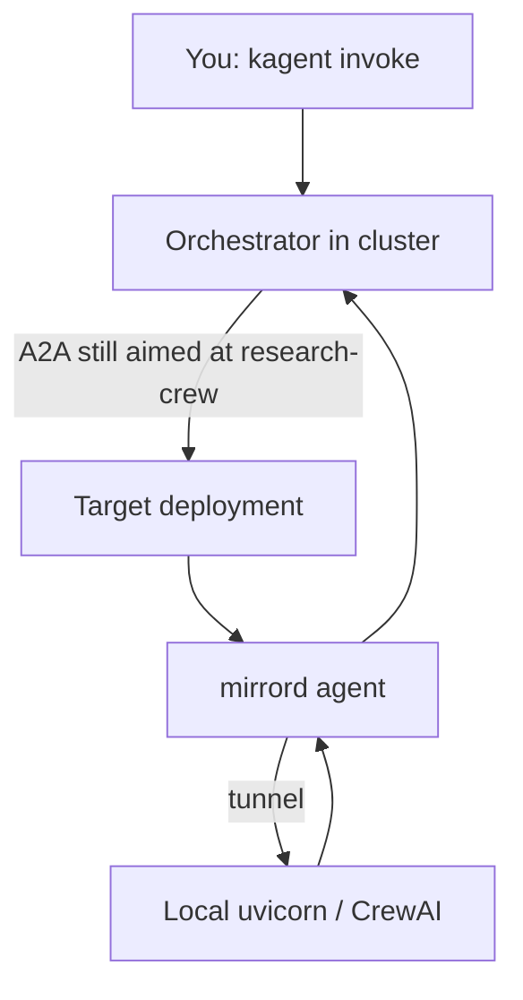

# kagent + mirrord: live A2A agent substitution

**Hackathon submission:** Run a real [kagent](https://kagent.dev) multi-agent flow in Kubernetes, then swap the **BYO CrewAI agent** (`research-crew`) for **your laptop** at runtime—**no image rebuild, no changing orchestrator URLs**. Traffic the orchestrator sends over **A2A (HTTP + agent card)** to the in-cluster deployment is **stolen** by [mirrord](https://mirrord.dev) and served by your local process instead.

---

## What judges should take away

| Idea | In one sentence |
|------|------------------|
| **Stack** | Declarative **orchestrator** agent + **CrewAI** BYO agent on **Kubernetes**, wired over **A2A**. |
| **Problem** | Iterating on the BYO agent usually means **build → push → rollout**; `kagent run` alone does not put you **inside** the live orchestrator chain. |
| **Solution** | **mirrord steal** on `deployment/research-crew`: the same A2A calls the orchestrator already makes hit **your local `crew/main.py`**. |
| **Proof** | Edit **`crew/crew.py`**, restart **only** `./scripts/mirrord-crew.sh` (no Docker), run the **same** `kagent invoke`—behavior changes because **your laptop** is now **`research-crew`**. |

---

## Architecture

**Without mirrord** — the in-cluster pod handles all A2A to `research-crew`:



**With mirrord** — A2A to the deployment is tunneled to your machine; orchestrator config is unchanged:



---

## Live demo (two terminals)

1. **One-time setup** (Docker on, API key set—see below):

   ```bash
   cd kagent-mirrord
   export ANTHROPIC_API_KEY=sk-ant-...   # or put it in .env for setup.sh
   ./scripts/setup.sh
   ```

2. **Optional:** confirm the chain works in-cluster only:

   ```bash
   kagent invoke --agent orchestrator --task "In one sentence, what is kagent?"
   ```

   If this hangs or errors on controller connection, see **Troubleshooting** (`KAGENT_URL` / port-forward).

3. **Terminal 1 — your laptop becomes `research-crew`:**

   ```bash
   ./scripts/mirrord-crew.sh
   ```

   Leave it running. You should see **Uvicorn on port 8080** and mirrord **steal** / **Ready**.

4. **Terminal 2 — same orchestrator, same cluster:**

   ```bash
   kagent invoke --agent orchestrator --task "Research what kagent is"
   ```

5. **Show substitution:** change **`crew/crew.py`** (e.g. the sarcastic summarizer block at the bottom of the file), **Ctrl+C** Terminal 1, run **`./scripts/mirrord-crew.sh`** again, repeat the **same** invoke. **No** `docker build`. That is **runtime agent substitution** in a live **A2A** chain.

**How you explain “mirrord + A2A”:** The orchestrator still calls **`research-crew`** as declared in **`agents/orchestrator.yaml`**. A2A is HTTP (e.g. **`/.well-known/agent-card.json`** plus task routes). Mirrord intercepts that traffic bound for the pod and your local app answers—so you are **in** the multi-agent graph, not running a separate offline script.

---

## Prerequisites

- **Docker**, **kubectl**, local Kubernetes (**minikube** default, or **kind**: `CLUSTER=kind ./scripts/setup.sh`)
- **[kagent](https://kagent.dev)** CLI — e.g. `brew install kagent`
- **[mirrord](https://mirrord.dev)** — e.g. `brew install metalbear-co/mirrord/mirrord`
- **`ANTHROPIC_API_KEY`** — one key for orchestrator + crew; see **`.env.example`**. `setup.sh` sources **`.env`** if present.

**Models:** this repo defaults orchestrator and crew to **Haiku** (`claude-haiku-4-5`) so tight Anthropic RPM limits do not kill demos. Sonnet is available in **`agents/claude-model-config.yaml`** if your quota allows.

---

## Scripts (quick reference)

| Script | Purpose |
|--------|---------|
| **`./scripts/setup.sh`** | Cluster, registry (minikube/kind), **`kagent install`** path, image build/load, secrets, apply **`agents/`** |
| **`./scripts/mirrord-crew.sh`** | Creates **`.venv`** (Python 3.10+), installs deps with **uv** (avoids pip resolution issues), runs **`mirrord exec -f mirrord/research-crew.json`** + **`crew/main.py`** |
| **`./scripts/validate.sh`** | Config and sanity checks without a full cluster |

**Python on the laptop:** use **`./scripts/mirrord-crew.sh`** so **`kagent-crewai`** runs in the same venv as mirrord. Plain **`pip install -r requirements-local.txt`** often hits **resolution-too-deep**; the helper uses **uv** automatically.

---

## Repo layout

| Path | Role |
|------|------|
| **`agents/`** | `orchestrator` + `research-crew` `Agent` CRDs, **`claude-model-config`**, secrets wiring |
| **`crew/`** | CrewAI app, **`main.py`**, **Dockerfile** for the BYO image |
| **`mirrord/research-crew.json`** | Steal target, env (API key from pod + **`KAGENT_*`** overrides for local **`kagent-crewai`**) |
| **`requirements-local.txt`** | Laptop stack aligned with the image (installed via **`mirrord-crew.sh`** + uv) |

### mirrord config (behavioral summary)

- **Target:** `deployment/research-crew` in namespace **`kagent`**
- **Incoming:** **steal** (redirect workload traffic to the local process)
- **Env:** load **`ANTHROPIC_API_KEY`** from the pod; **override** **`KAGENT_URL`**, **`KAGENT_NAME`**, **`KAGENT_NAMESPACE`** so the local **`kagent-crewai`** process can talk to the controller (cluster DNS via mirrord)

Run **`mirrord verify-config mirrord/research-crew.json`** after edits.

---

## Troubleshooting

| Symptom | What to try |
|---------|-------------|
| **`kagent` / invoke cannot reach controller** | **`kubectl port-forward svc/kagent-controller 8083:8083 -n kagent`**; if needed set **`KAGENT_URL`** in **`mirrord/research-crew.json`** `env.override` to **`http://127.0.0.1:8083`** |
| **`KAGENT_URL environment variable is not set`** | Use repo **`mirrord/research-crew.json`** as committed; ensure **`mirrord-crew.sh`** uses that file |
| **`ModuleNotFoundError: No module named 'kagent'`** | Run **`./scripts/mirrord-crew.sh`** (venv + uv install)—do not use system **`python3`** alone for mirrord |
| **mirrord cannot find target** | **`kubectl get deploy -n kagent`** — expect **`research-crew`** |
| **Anthropic `rate_limit_error`** | Wait a minute; stay on default **Haiku**; avoid switching orchestrator to **Sonnet** on low RPM tiers |
| **Helm / ghcr `403` on install** | **`helm registry logout ghcr.io`** then **`kagent install`** again |
| **Two `research-crew` pods / one bad** | **`kubectl get rs -n kagent \| grep research`** — remove stale ReplicaSet or rerun **`./scripts/setup.sh`** |
| **minikube image not picked up** | Image tag **`research-crew:mirrord-local`**; **`minikube image load`** after host **`docker build`** |

---

## Acknowledgements

Built for the kagent ecosystem hackathon: **[kagent](https://kagent.dev)** (CNCF Sandbox) and **[mirrord](https://mirrord.dev)** (MetalBear).
