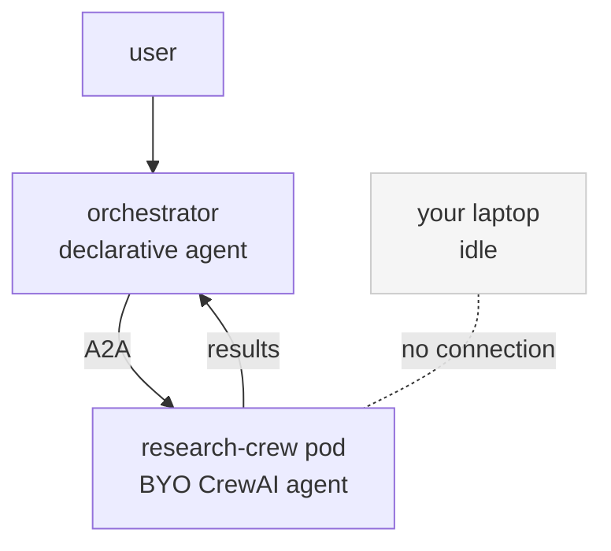
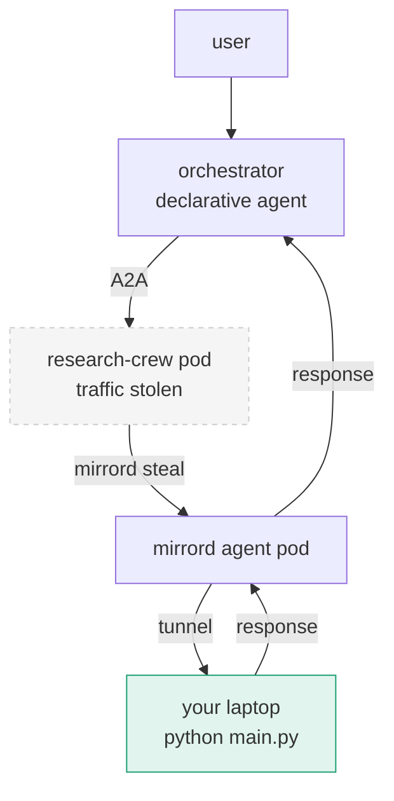

# kagent-mirrord

Inject a local agent into a live kagent A2A chain — no rebuild, no redeploy.

> You are not running an agent locally. You are replacing a live node in a running multi-agent system — without restarting anything.

## The problem

kagent lets you build multi-agent systems where a declarative orchestrator calls BYO agents (CrewAI, LangGraph, ADK) over A2A. Each BYO agent runs as its own pod in the cluster.

When you want to change a BYO agent's behavior, you need to:
1. edit the code
2. rebuild the Docker image
3. push it to the registry
4. wait for the rollout

That loop takes 2+ minutes. But that is not the real problem.

The real problem is that `kagent run` only runs your agent in isolation. It cannot put your local code inside a live A2A chain where the orchestrator is already calling it. Your laptop is unreachable from inside the cluster.

mirrord solves this differently: it steals the A2A traffic coming into your deployed pod and routes it to your local process instead. You are not just running an agent locally — you are replacing a live node in a running multi-agent system, at runtime, without touching Kubernetes.

## Why not port-forward?

Port-forward only goes one direction: your laptop → cluster. The orchestrator agent cannot reach your laptop via port-forward. You would need to patch Kubernetes service endpoints and inject env vars manually. mirrord handles both directions and cleans up automatically.

## Architecture

### Without mirrord



### With mirrord



## Why this matters for agent systems

Single agents are easy to test locally. Multi-agent systems are not.

When your agent is a node inside a chain — called by an orchestrator, calling other services — you cannot test it in isolation. The behavior you care about only emerges when the full system is running.

mirrord makes your local process a first-class node in that system:

- the orchestrator calls it like any other agent
- it gets the real secrets and env vars from the cluster
- it can call other in-cluster services (databases, MCP servers, other agents)
- nothing else in the system changes

This is not just a faster dev loop. It is runtime agent substitution — replacing a deployed agent with a local one, mid-flight, without restarting anything.

## Prerequisites

- **kubectl** — Kubernetes CLI
- **minikube** (default) or **kind** — local Kubernetes cluster
- **kagent** — `brew install kagent`
- **mirrord** — `brew install metalbear-co/mirrord/mirrord`
- **Docker** — for building images

**API keys (hackathon-friendly):**
- **ANTHROPIC_API_KEY** — one [Claude / Anthropic](https://console.anthropic.com/) key for everything. `./scripts/setup.sh` writes it into:
  - **`kagent-anthropic`** + **`ModelConfig` `claude-model-config`** — declarative **orchestrator** (Claude `claude-3-5-sonnet-20241022`).
  - **`research-crew-secrets`** — BYO **research-crew** (same model via CrewAI).
  Optional: put it in **`.env`** (gitignored); see `.env.example`.

**Note:** The `kagent-crewai` package is on PyPI. If you need the latest from source:
```bash
pip install git+https://github.com/kagent-dev/kagent.git#subdirectory=python/packages/kagent-crewai
```

## Quickstart

**Note:** Docker must be running. For minikube, start Docker Desktop (or your Docker daemon) first.

```bash
# 1. clone this repo
git clone https://github.com/YOUR_USERNAME/kagent-mirrord
cd kagent-mirrord

# 2. set your Anthropic API key (see .env.example)
export ANTHROPIC_API_KEY=sk-ant-...

# 3. run setup (creates minikube cluster, builds image, deploys agents)
chmod +x scripts/setup.sh && ./scripts/setup.sh

# 4. verify the chain works end to end
kagent invoke --agent orchestrator --task "Research what kagent is"

# 5. now start your mirrord dev session (run from repo root)
mirrord exec -f mirrord/research-crew.json -- python crew/main.py
```

For **kind** instead of minikube: `CLUSTER=kind ./scripts/setup.sh`

**Validate without full setup:** `./scripts/validate.sh` (checks mirrord config, Python syntax, YAML, prerequisites)

## The demo

Two terminals. One change. Same system.

**Terminal 1 — start your local agent inside the live chain:**
```bash
mirrord exec -f mirrord/research-crew.json -- python crew/main.py
```

```
mirrord agent started
stealing traffic from deployment/research-crew
env: ANTHROPIC_API_KEY loaded from pod
waiting for A2A requests...
```

**Terminal 2 — invoke the orchestrator (it calls your local process):**
```bash
kagent invoke --agent orchestrator --task "Research recent CNCF sandbox projects"
```

You get a full research summary back. Your local code handled it. The deployed research-crew pod received zero traffic.

**Now make it memorable:**

1. Open `crew/crew.py`
2. Replace the summarizer block with the sarcastic version at the bottom of the file (uncomment that block)
3. Ctrl+C mirrord and restart it
4. Run the same `kagent invoke` command again

Same orchestrator. Same deployed pods. Same task. Completely different behavior — because your local code is now the agent.

That is runtime agent substitution.

## How it works

When you run `mirrord exec -f mirrord/research-crew.json -- python crew/main.py`:

1. mirrord reads your kubeconfig and connects to the cluster
2. it spawns a short-lived privileged agent pod on the same node as research-crew
3. that agent pod intercepts all incoming A2A HTTP traffic to research-crew
4. traffic is forwarded through a tunnel to your local process
5. env vars and secrets from the pod are injected into your local process automatically
6. your local process responds — the orchestrator sees no difference
7. when you Ctrl+C, the agent pod is deleted and traffic returns to the deployed pod

No service patching. No kubeconfig changes. No cluster configuration touched.

## mirrord: config file vs CLI

**Recommended (this repo):**
```bash
mirrord exec -f mirrord/research-crew.json -- python crew/main.py
```

**Same behavior without a config file:**
```bash
mirrord exec -t deployment/research-crew -n kagent --steal -s "ANTHROPIC_API_KEY" -- python crew/main.py
```

`deploy/research-crew` is accepted as an alias for `deployment/research-crew`. Without `--steal` or the JSON `incoming.mode`, traffic is mirrored instead of redirected to your laptop.

## Is this a real mirrord fit or a stretch?

It is a solid fit, not a gimmick. mirrord is built for running a local process while it receives the same incoming connections and cluster context as a target workload. A BYO kagent agent is exactly that: a long-lived pod that accepts A2A HTTP traffic; the orchestrator keeps calling the same service URL while mirrord steals packets destined for that deployment and forwards them to your machine. You are not simulating the chain—you are a node in it.

What to watch for when demoing: the Kubernetes `Deployment` must be named `research-crew` (same as the Agent). Confirm with `kubectl get deploy -n kagent`. If your kagent version names resources differently, update `mirrord/research-crew.json` `target.path` to match. On minikube, if the pod stays in `ImagePullBackOff`, ensure you ran `minikube image load research-crew:latest` after building, or switch to a registry image the cluster can pull.

## Troubleshooting

| Symptom | What to check |
|--------|----------------|
| mirrord cannot find target | `kubectl get deploy -n kagent` — name should be `research-crew` |
| research-crew pod not ready | `kubectl get pods -n kagent` — `kubectl describe pod …` on the failing pod |
| Image pull errors (minikube) | Re-run `docker build -t research-crew:latest crew` then `minikube image load research-crew:latest` |
| Orchestrator errors | `kubectl get agents -n kagent` — both `research-crew` and `orchestrator` should exist |
| Orchestrator **`401` / auth errors | Re-run `./scripts/setup.sh` so **`kagent-anthropic`** and **`claude-model-config`** match your key. Or: `kubectl create secret generic kagent-anthropic --from-literal=ANTHROPIC_API_KEY="$ANTHROPIC_API_KEY" -n kagent -o yaml --dry-run=client | kubectl apply -f -` then `kubectl rollout restart deployment/orchestrator -n kagent`. |
| Anthropic **rate limits / billing** | Check [Anthropic console](https://console.anthropic.com/) for credits, plan limits, and key validity. |
| `kagent install` / Helm `403` from `ghcr.io` | Stale Helm credentials often cause false **denied** on public charts. Run **`helm registry logout ghcr.io`** then **`kagent install --profile demo`** again. |
| Stale `research-crew:latest` on minikube | Setup uses **host** `docker build` then `minikube image load … --overwrite=true`. If builds fail inside minikube’s Docker, avoid `minikube docker-env` (Docker Hub DNS often breaks there). |

## Project layout

| Path | Role |
|------|------|
| `agents/` | `Agent` CRDs + `ModelConfig` `claude-model-config` (Claude for orchestrator) |
| `crew/` | CrewAI app + Dockerfile consumed by the BYO image |
| `mirrord/research-crew.json` | Steal + env from the live research-crew deployment |
| `scripts/setup.sh` | Idempotent cluster + image + apply |
| `scripts/validate.sh` | mirrord verify-config, syntax, optional kubectl dry-run |

## The mirrord.json explained

```json
{
  "target": {
    "path": "deployment/research-crew",   // k8s deployment to steal from
    "namespace": "kagent"
  },
  "feature": {
    "network": {
      "incoming": {
        "mode": "steal"                    // route A2A traffic to local process
      }
    },
    "env": {
      "include": "ANTHROPIC_API_KEY"  // pull Claude secret from pod
    }
  }
}
```

## Acknowledgements

Built for the kagent ecosystem hackathon. Uses [kagent](https://kagent.dev) (CNCF Sandbox project) and [mirrord](https://mirrord.dev) by MetalBear.
