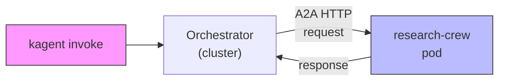
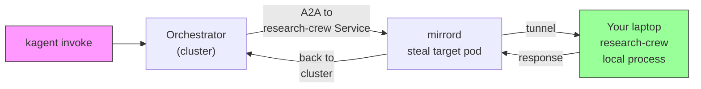

# kagent + mirrord: develop BYO agents locally, stay in the live graph

**AI Hackathon submission**

**Thesis:** **[kagent](https://kagent.dev)** runs multi-agent workloads on Kubernetes; **[mirrord](https://mirrord.dev)** is a strong fit for **developer velocity** on that stack because it lets you **run one agent locally** while the **live orchestrator** still sends it the **same production-style traffic**—without rebuilding images or changing how agents are wired together.

This repo is a minimal demo: a declarative **orchestrator** agent in-cluster calls a **BYO** `research-crew` agent (CrewAI). You prove the loop by running `mirrord exec`, invoking the orchestrator again, and watching **real HTTP** hit your laptop.

---


| Building BYO agents on kagent alone | + mirrord while you iterate |
|-------------------------------------|-----------------------------|
| Small changes still push you through image build / deploy to feel “real” | Restart **one** local process; next invoke exercises **the same** orchestration path |
| Easy to test the agent in isolation and miss integration bugs | You receive **actual** traffic from the **live** orchestrator over the same HTTP surface |
| Dev tools live in the container or you maintain parallel mocks | Full **laptop** toolchain (deps, debugger, fast edits) against **cluster** context |

**Scaling the idea:** With many agents, you only run mirrord for **whoever you’re editing**—the rest stay in pods. This demo steals **one** deployment; you’d add a second config and port if you developed two agents locally.

---

## The stack

- **[kagent](https://kagent.dev)** (CNCF Sandbox): declarative multi-agent orchestrator; BYO agents as Deployments + Agent CRDs.
- **[mirrord](https://mirrord.dev)** (MetalBear): steal/mirror incoming traffic from a target workload to a local process.
- **CrewAI** + **kagent-crewai**: example BYO implementation (swappable for your own HTTP+A2A server).
- **Anthropic Claude**: LLM for orchestrator + research agent in this demo.
- **Kubernetes** (minikube/kind): local cluster.

---

## Architecture

**Without mirrord** — the in-cluster pod handles all A2A to `research-crew`:



**With mirrord** — traffic to the research-crew **workload** is steered to your laptop; the orchestrator still uses the same Service URL:



---

## Quickstart (two terminals)

### Prerequisites (install once)

```bash
# Kubernetes (local)
brew install minikube docker kubectl

# kagent CLI
brew install kagent

# mirrord
brew install metalbear-co/mirrord/mirrord

# Anthropic API key (orchestrator + research-crew in this demo)
export ANTHROPIC_API_KEY=sk-ant-...
```

### Step 1: Cluster + agents (~5 min)

```bash
cd kagent-mirrord
minikube start   # or use kind; see scripts/setup.sh
./scripts/setup.sh
```

**Verify:** `kubectl get pods -n kagent` — `kagent-controller` and `research-crew` should run.

### Step 2: Baseline (cluster-only)

```bash
kagent invoke --agent orchestrator --task "What is kagent in one sentence?"
```

Orchestrator calls in-cluster `research-crew` over A2A; you get an answer. **Before state.**

### Step 3: Terminal 1 — local BYO agent under mirrord

```bash
./scripts/mirrord-crew.sh
```

Expect mirrord ready + Uvicorn on `:8080`. **The pod still exists; steal mode sends incoming agent traffic to your process.**

### Step 4: Terminal 2 — same invoke, traffic hits your machine

```bash
kagent invoke --agent orchestrator --task "What is kagent in one sentence?"
```

On Terminal 1 you should see:

```text
GET /.well-known/agent-card.json   # discovery
POST / HTTP/1.1                    # A2A JSON-RPC
```

### Step 5: Change behavior without a new image

Edit `crew/crew.py` (e.g. uncomment the “Sarcastic Summarizer” example at the bottom). **Restart** `./scripts/mirrord-crew.sh` (the crew is built at import time). Invoke again—same cluster, same URLs, different agent logic.

---

## Repo layout

| Path | Role |
|------|------|
| **`agents/`** | `orchestrator` + `research-crew` Agent CRDs; `claude-model-config` |
| **`crew/`** | BYO app: `main.py` (KAgentApp + Uvicorn), `crew.py` (CrewAI), `Dockerfile` |
| **`mirrord/research-crew.json`** | Target `deployment/research-crew`, steal, env from cluster + `KAGENT_*` overrides |
| **`scripts/`** | `setup.sh`, `mirrord-crew.sh`, `validate.sh` |
| **`requirements-local.txt`** | Laptop deps (installed via `uv` in `mirrord-crew.sh`) |

### `mirrord/research-crew.json` (reference)

```json
{
  "target": { "path": "deployment/research-crew", "namespace": "kagent" },
  "feature": {
    "network": { "incoming": { "mode": "steal" } },
    "env": {
      "include": "ANTHROPIC_API_KEY",
      "override": {
        "KAGENT_URL": "http://kagent-controller.kagent.svc.cluster.local:8083",
        "KAGENT_NAME": "research-crew",
        "KAGENT_NAMESPACE": "kagent"
      }
    }
  }
}
```

---

## Scripts

| Script | Purpose |
|--------|---------|
| `./scripts/setup.sh` | Cluster, kagent demo profile, image, secrets, apply agents |
| `./scripts/mirrord-crew.sh` | `.venv` + deps + `mirrord exec` + `crew/main.py` |
| `./scripts/validate.sh` | `mirrord verify-config`, Python syntax, optional YAML dry-run |

**Note:** After changing `crew/crew.py`, restart `mirrord-crew.sh` so `ResearchCrew` reloads.


---

## Acknowledgements

- **[kagent](https://kagent.dev)** — multi-agent orchestration on Kubernetes  
- **[mirrord](https://mirrord.dev)** — traffic steering for local development  
- **[CrewAI](https://github.com/joaomdmoura/crewai)** — example BYO runtime  
- **[Anthropic](https://www.anthropic.com/)** — LLM inference in this demo  
